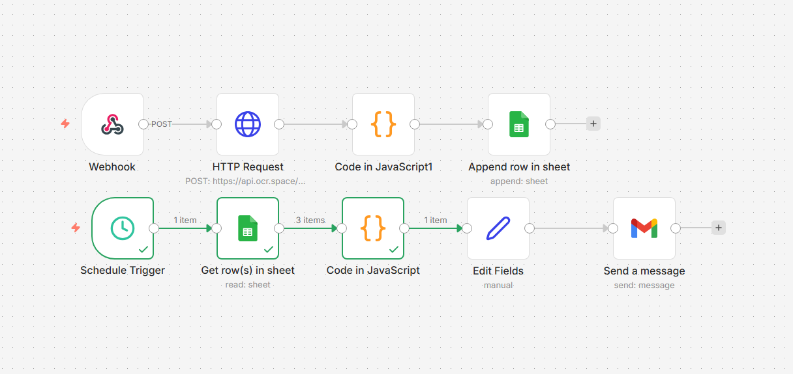

# AI FinTech Slip Processing & Expense Insight Automation

## Overview

This project demonstrates an **automated financial transaction pipeline** that processes payment slips, extracts transaction information using OCR, stores the data in a database (Google Sheets), and generates **daily financial insights automatically via email**.

The system simulates a **lightweight FinTech backend workflow**, integrating automation tools, APIs, and data analytics to transform unstructured slip images into structured financial data.

---

## Key Features

* **Mobile Slip Upload**

  * Users upload payment slips through a simple web interface hosted on GitHub Pages.

* **Webhook-based API**

  * Uploaded images are sent to an n8n webhook endpoint for processing.

* **OCR Processing**

  * The system extracts text from payment slips using an OCR API.

* **Transaction Extraction**

  * JavaScript logic parses OCR results to identify transaction fields such as:
  * transaction amount
  * time
  * date
  * raw transaction text

* **Transaction Database**

  * Structured transaction records are stored in **Google Sheets**.

* **Daily Financial Insights**

  * A scheduled automation calculates daily statistics and sends a summary report via email.

---

## System Architecture



### Real-Time Processing Pipeline

Mobile Upload Page
↓
n8n Webhook
↓
OCR API
↓
Transaction Extraction
↓
Google Sheets Database

### Daily Insight Automation

Schedule Trigger
↓
Read Transactions from Sheet
↓
Calculate Daily Statistics
↓
Generate Report
↓
Send Email via Gmail

---

## Example Daily Report

```
Daily FinTech Spending Report

Date: 2026-03-09
Total Transactions: 5
Total Spending: 320 THB
Largest Transaction: 120 THB
```

---

## Technologies Used

* **n8n** — workflow automation platform
* **OCR API** — image text recognition
* **JavaScript** — data extraction and processing
* **Google Sheets API** — lightweight transaction storage
* **GitHub Pages** — mobile-friendly upload interface
* **HTML / CSS / JavaScript** — frontend upload page


---

## How It Works

1. A user uploads a payment slip through the web interface.
2. The image is sent to the n8n webhook.
3. OCR extracts text from the slip.
4. A JavaScript node parses the text to identify transaction details.
5. The transaction record is stored in Google Sheets.
6. Every day, the scheduled workflow generates a financial summary and emails the report.

---

## Future Improvements

Potential enhancements for a production-ready system:

* Automatic **expense category classification**
* **Dashboard visualization** (Power BI / Tableau)
* Secure **API authentication**
* Improved **Thai-language OCR accuracy**
* Transaction **fraud detection / anomaly detection**

---

## Author

**Chiewchan Sumalares**
Digital Technology and Integrated Innovation (International Program)
King Mongkut's Institute of Technology Ladkrabang

GitHub: https://github.com/ChiewchanSM
